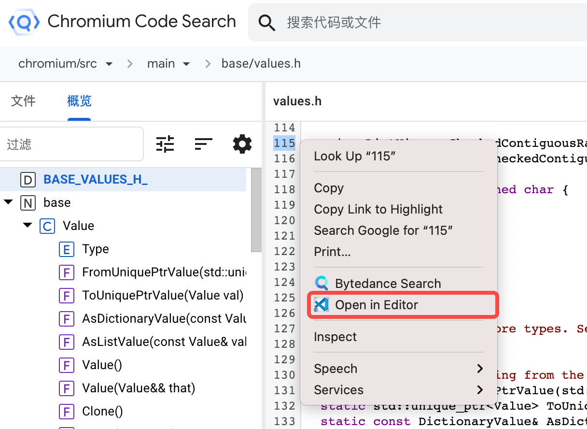
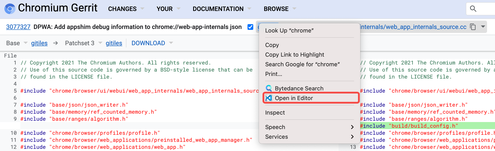
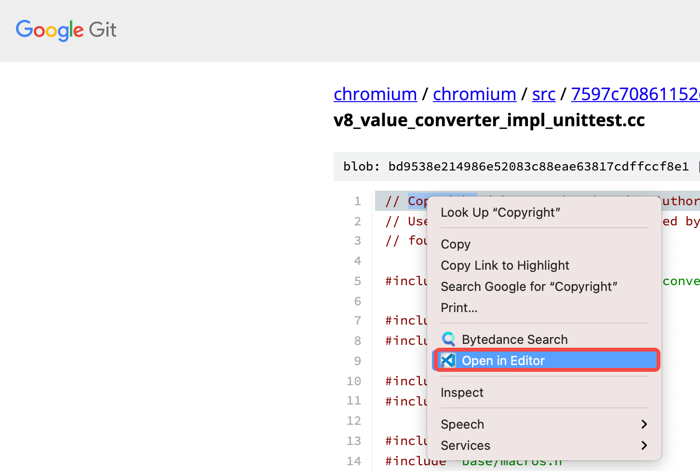

# Chromium Open IDE (COI)

`COI` gives you a context menu for opening files in your editor (`VSCode`) on
[Chromium Code Search](https://source.chromium.org) and
[Chromium Code Review](https://chromium-review.googlesource.com).

## Installation

Install the [Chrome Extension](https://github.com/song-fangzhen/chromium-open-ide/releases/tag/v1.1) and related [VScode Extension](https://marketplace.visualstudio.com/items?itemName=FangzhenSong.chromium-source-opener).

## Usage

- For [Chromium Code Search](https://source.chromium.org), right click on code block and select `Open My Editor`, 
it will open the file in your editor at the selected line.

    

- For [Chromium Code Review](https://chromium-review.googlesource.com), right click on a filename and select 
`Open My Editor`, it will open the file in your editor.

    

    *Tips: Before using, we should check that have started listening from `VScode`.*

    

**Enjoy!**
