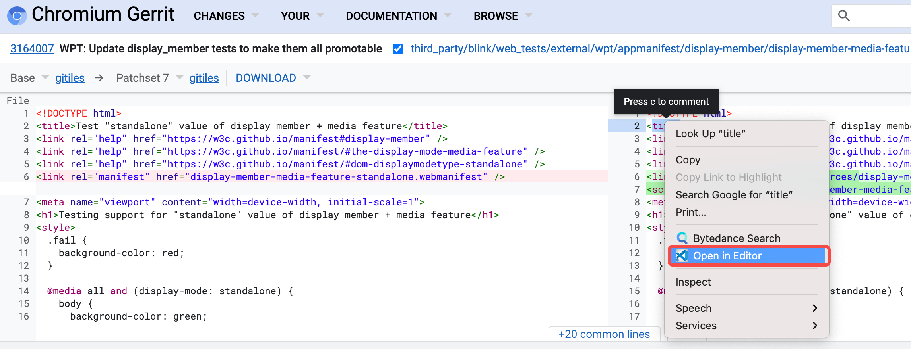

# Chromium Open IDE (COI)

`COI` gives you a context menu for opening files in your editor (`VSCode`) on
[Chromium Code Search](https://source.chromium.org),
[Chromium Code Review](https://chromium-review.googlesource.com),
[Google Git](https://chromium.googlesource.com) and
[webdiffForCOI](https://pypi.org/project/webdiffForCOI).

## Installation

Install this [MSEdge Extension](https://microsoftedge.microsoft.com/addons/detail/chromium-open-ide/ggfoollpnfolfaejalpiihpobcpbegkl) and related [VSCode Extension](https://marketplace.visualstudio.com/items?itemName=FangzhenSong.chromium-source-opener).

## Usage

- For [Chromium Code Search](https://source.chromium.org): right-click on code block and select `Open My Editor`, 
it will open the file in your editor at the selected line.

    

- For [Chromium Code Review](https://chromium-review.googlesource.com): right-click on a filename and select 
`Open My Editor`, will open the file in your editor.

    

- For [Google Git](https://chromium.googlesource.com):

    - click on the line number (optional).
    - choose and right-click on any code block.
    - select `Open My Editor`.

    It will open the file in your editor (at the selected line).

    
    
    *Tips: Before using, we should check that have started listening from `VSCode`.*

    

**Enjoy!**
